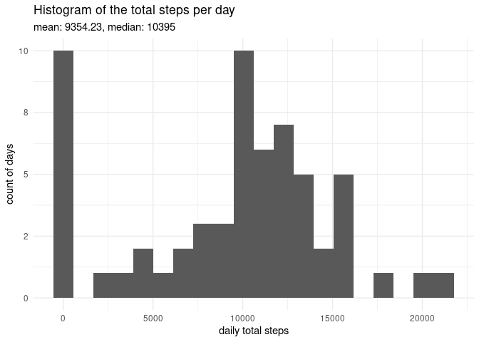
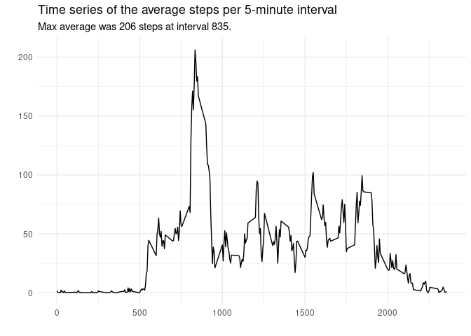
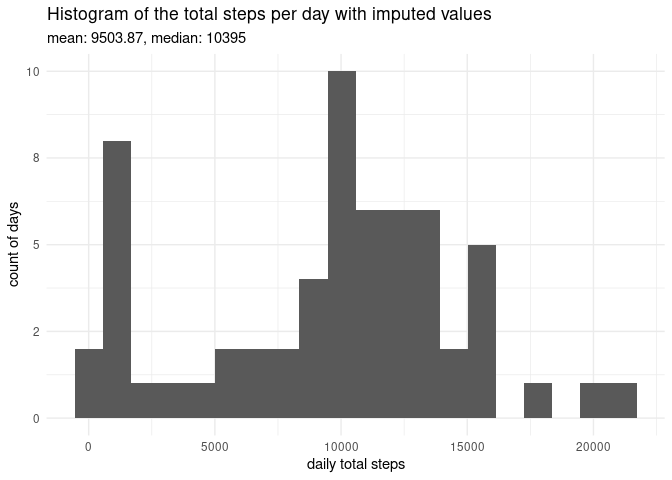
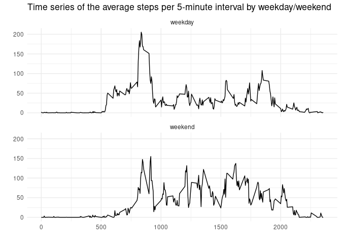

```r
library(tidyverse, warn.conflicts = FALSE)
library(glue)
library(ggplot2)
library(scales, warn.conflicts = FALSE)

options(scipen=999)
```


## Loading and preprocessing the data


```r
# read data directy from zip into a tibble
activity <- readr::read_csv(here::here("activity.zip"), col_types = cols())
```


## What is mean total number of steps taken per day?


```r
# get the total steps for each day
steps_per_day <- 
    activity %>%
    group_by(date) %>%
    summarise(
        total_steps = sum(steps, na.rm = TRUE), 
        .groups = "drop")
    
# then the mean & median 
average_steps_per_day <- 
    steps_per_day %>%
    summarise(
        mean = round(mean(total_steps, na.rm = TRUE), 2), 
        median = round(median(total_steps, na.rm = TRUE), 2))
```

- mean steps per day: 9354.23
- median steps per day: 10395 


```r
steps_per_day %>%
    ggplot(aes(x = total_steps)) + 
    geom_histogram(bins = 20) + 
    labs(
        title = "Histogram of the total steps per day", 
        subtitle = glue("mean: {average_steps_per_day$mean}, median: {average_steps_per_day$median}"), 
        x = "daily total steps",
        y = "count of days"
    ) + 
    scale_y_continuous(labels = label_number(accuracy = 1)) + 
    theme_minimal()
```

<!-- -->


## What is the average daily activity pattern?


```r
steps_per_interval <- 
    activity %>%
    group_by(interval) %>%
    summarise(
        mean_steps = mean(steps, na.rm = TRUE), 
        .groups = "drop")

max_mean_steps_per_interval <- 
    steps_per_interval %>%
    filter(mean_steps == max(mean_steps)) %>%
    mutate(mean_steps = round(mean_steps,0)) %>%
    select(interval, mean_steps)
```

The maximum average number of steps per interval  was 206 steps at interval 835. 


```r
steps_per_interval %>%
    ggplot(aes(x = interval, y = mean_steps)) + 
    geom_line() + 
    labs(
        title = "Time series of the average steps per 5-minute interval", 
        subtitle = glue("Max average was {max_mean_steps_per_interval$mean_steps} steps at interval {max_mean_steps_per_interval$interval}. "),
        x = "",
        y = ""
    ) + 
    #scale_y_continuous(labels = label_number(accuracy = 1)) + 
    theme_minimal()
```

<!-- -->


## Imputing missing values


```r
# get the total count of missing values of steps

missing_steps <- 
    activity %>%
    filter(is.na(steps)) %>%
    count()

# replace NA values with the mean steps for that interval
activity_imputed <-
    activity %>%
    group_by(interval) %>%
    mutate(
        #steps = coalesce(steps, mean(steps, na.rm = TRUE)), 
        steps = coalesce(steps, median(steps, na.rm = TRUE))
        )

# get the total steps for each day
steps_per_day_imputed <- 
    activity_imputed %>%
    group_by(date) %>%
    summarise(
        total_steps = sum(steps, na.rm = TRUE), 
        .groups = "drop")
    
# then the mean & median 
average_steps_per_day_imputed <- 
    steps_per_day_imputed %>%
    summarise(
        mean = round(mean(total_steps, na.rm = TRUE),2), 
        median = round(median(total_steps, na.rm = TRUE), 2)) 
```

There were 2304 records with missing values.  

The strategy for imputing missing values was to replace NA values with the median value for that interval. 

The impact was that the mean total steps per day were increased to be closer to the median steps per day, while the median steps per day was not affected. 

- _imputed_ mean steps per day: 9503.87
- _imputed_ median steps per day: 10395 


```r
steps_per_day_imputed %>%
    ggplot(aes(x = total_steps)) + 
    geom_histogram(bins = 20) + 
    labs(
        title = "Histogram of the total steps per day with imputed values", 
        subtitle = glue("mean: {average_steps_per_day_imputed$mean}, median: {average_steps_per_day_imputed$median}"), 
        x = "daily total steps",
        y = "count of days"
    ) + 
    scale_y_continuous(labels = label_number(accuracy = 1)) + 
    theme_minimal()
```

<!-- -->


## Are there differences in activity patterns between weekdays and weekends?


```r
# add a day of week factor value
activity_imputed_dow <- 
    activity_imputed %>%
    mutate(
        dow = weekdays(date), 
        week_day_end = as.factor(if_else(grepl("^S", dow), "weekend", "weekday"))
           )

steps_per_interval_imputed_dow <- 
    activity_imputed_dow %>%
    group_by(week_day_end, interval) %>%
    summarise(
        mean_steps = mean(steps, na.rm = TRUE), 
        .groups = "drop")

steps_per_interval_imputed_dow %>%
    ggplot(aes(x = interval, y = mean_steps)) + 
    geom_line() + 
    facet_wrap( ~ week_day_end, ncol = 1) +
    labs(
        title = "Time series of the average steps per 5-minute interval by weekday/weekend", 
        #subtitle = glue("Max average was {max_mean_steps_per_interval$mean_steps} steps at interval {max_mean_steps_per_interval$interval}. "),
        x = "",
        y = ""
    ) + 
    #scale_y_continuous(labels = label_number(accuracy = 1)) + 
    theme_minimal()
```

<!-- -->

